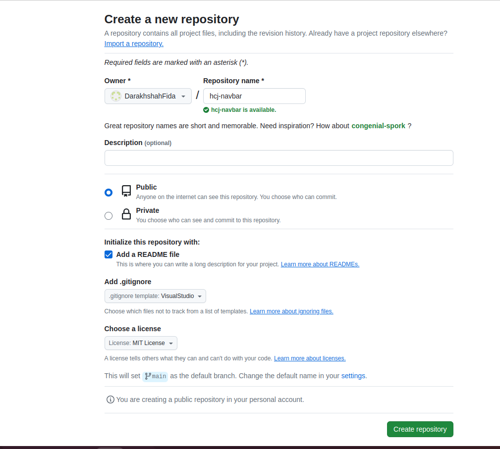
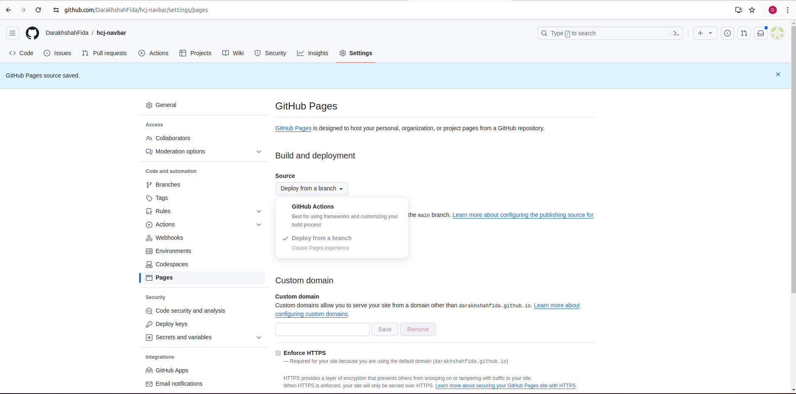
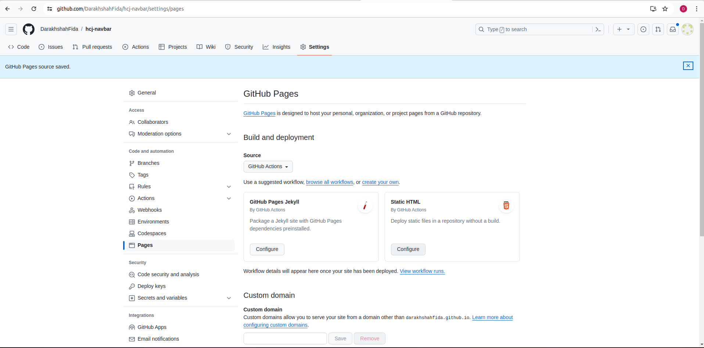
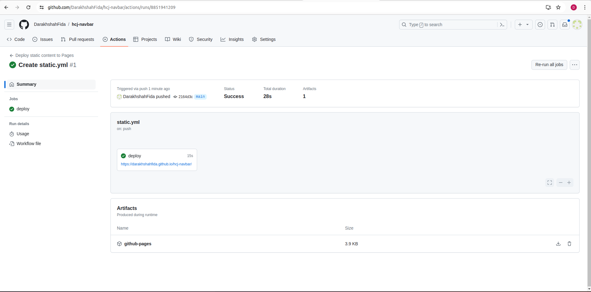
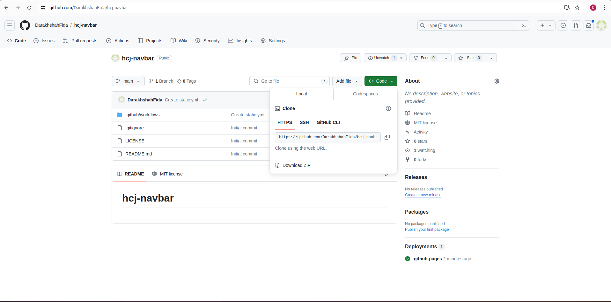
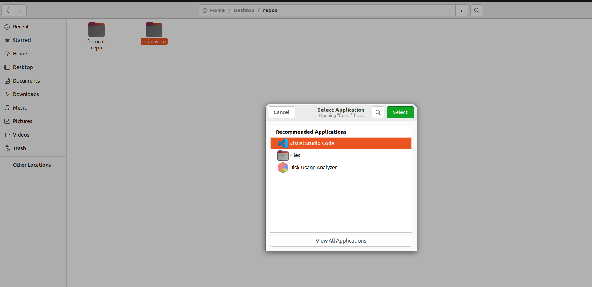
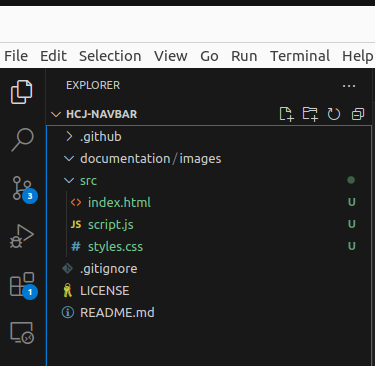
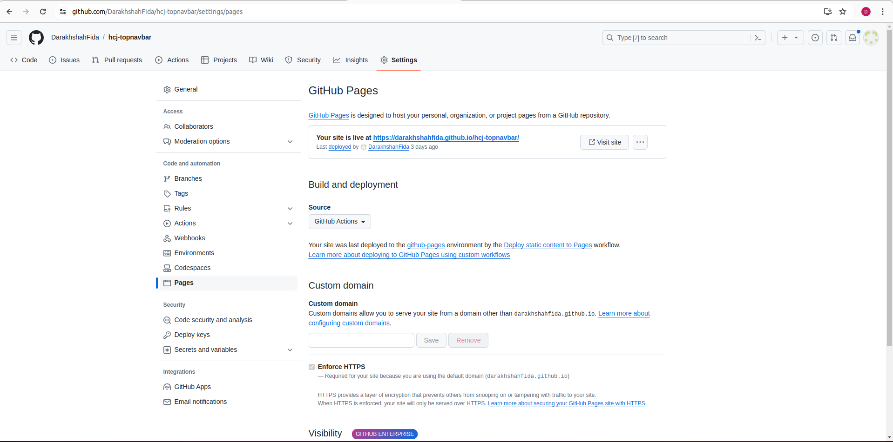
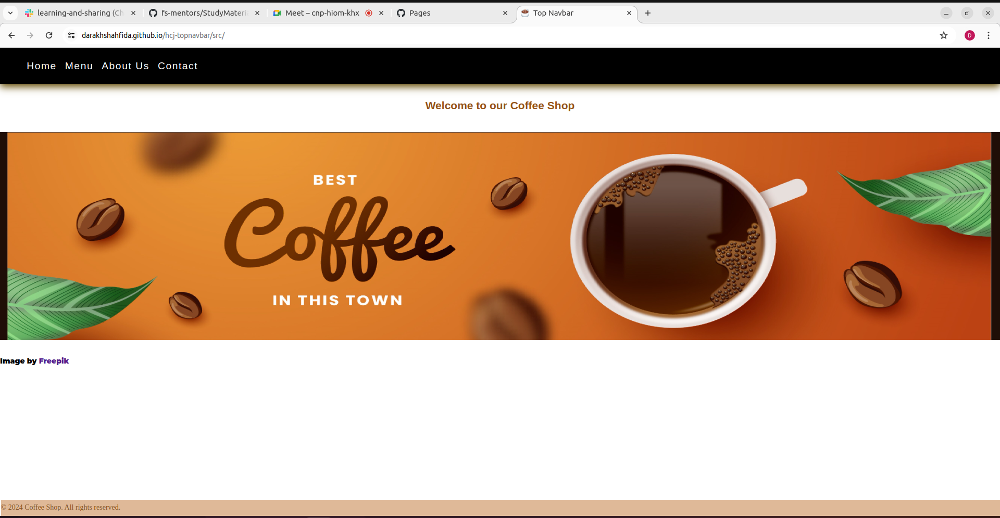

# hcj-topnavbar'
># Top Navbar using HTML, CSS and JavaScript

Mini Project of Top Navbar using HTML,CSS and JavaScript

---

## What are we doing today?

>1. [Learning to host a static website](#hosting-a-static-webpage)
>1. [Adding Html, Css and Javascript to your website](#adding-html-css-and-javascript-to-your-website)
>1. [Creating a favicon](#creating-a-favicon)

## Hosting a static webpage

### 1. Create a repository with the standard template



### 2. Go to Settings --> Pages -->  Github Actions



### 3. Under 'Static HTML' , select configure and commit your changes



### 4. Your static website has been deployed



>## Adding Html, Css and Javascript to your website

### 1. Clone your repository and open in VS code






### 2. Create the folder and file structure as shown below



### 3. Code for 'index.html'

``` html
<!DOCTYPE html>
<html lang="en">

<head>
  <meta charset="UTF-8" />
  <meta name="viewport" content="width=device-width, initial-scale=1.0" />
  <link rel="icon" href="favicon.ico" type="image/x-icon" />
  <link rel="stylesheet" href="https://cdnjs.cloudflare.com/ajax/libs/font-awesome/6.5.2/css/all.min.css"
    integrity="sha512-SnH5WK+bZxgPHs44uWIX+LLJAJ9/2PkPKZ5QiAj6Ta86w+fsb2TkcmfRyVX3pBnMFcV7oQPJkl9QevSCWr3W6A=="
    crossorigin="anonymous" referrerpolicy="no-referrer" />
  <link rel="stylesheet" href="styles.css" />
  <title>Misbah's Coffee Shop</title>
</head>

<body>
  <nav>
    <div class="nav-main">
      <div class="nav-header">
        <!-- &nbsp;&nbsp;<i class="fa-solid fa-mug-hot"></i> -->
      </div>
      <div>
        <ul class="menu">
          <li>
            <a href="#">Home</a>
          </li>
          <li>
            <a href="#">Menu</a>
          </li>
          <li>
            <a href="#">About Us</a>
          </li>
          <li>
            <a href="#">Contact</a>
          </li>
        </ul>
      </div>

  </nav>
  <div class="welcome-msg">
    <h2>Welcome To Our Coffee Shop</h2>
  </div>
  <div class="banner-div">
    
  </div>
  <p>Image by
    <a
      href="https://www.freepik.com/free-vector/realistic-coffee-shop-template_22896767.htm#query=coffee%20banner&position=1&from_view=keyword&track=ais&uuid=faf66f30-6102-4c4a-b9d6-56a8262fa0c6">
      Freepik
    </a>
  </p>
  <div class="footer">

    &copy; 2024 Coffee Shop. All rights reserved.
  </div>
  <script src="script.js"></script>
</body>

</html>

```

### 4. Code for 'styles.css'

```css
@import url("https://fonts.googleapis.com/css2?family=Montserrat:wght@900&display=swap");

* {
  box-sizing: border-box;
}

body {
  font-family: "Montserrat", sans-serif;
  margin: 0;
  padding: 0;
  height: 100vh;
  line-height: 2.2;
  font-size: 0.875rem;
  /* display:flex;
  flex-direction:column; */
}

/* h2 {
   font-size: 3rem;
  margin-bottom: 1rem; 
  color: #7a420e;
} */

/* img {
  height: 50px;
  width: 200px;
} */

/* i {
  font-size: 5rem;
  margin-bottom: 1rem;
  color: teal;
} */

nav {
  background: #35251b;
  box-shadow: 0 5px 15px #634b01;
}

.nav-main {
  max-width: 95%;
  margin: 0 0.2rem 0 0.2rem;
  display: flex;
  align-items: center;
  justify-content: flex-start;
}

.nav-header {
  display: flex;
  align-items: center;
  justify-content: space-between;
}

.menu {
  height: auto;
  display: flex;
}

ul {
  list-style-type: none;
  font-family: sans-serif;
}

a {
  text-decoration: none;
}

.menu a {
  color: white;
  font-weight: lighter;
  font-size: 1.2rem;
  letter-spacing: 0.1rem;
  display: block;
  padding: 0;
  margin: 0 0.5rem;
  transition: all 0.3s linear;
}

.menu a:hover {
  background: #07733d;
  color: #9ed1f5;
}

.welcome-msg {
  color: #634b01;
  display: flex;
  justify-content: center;
  font-family: sans-serif;
}

banner-div {
  margin-top: 0.7rem;
}

#banner1 {
  height: 400px;
  width: 100%;
}
.footer {
  background-color: #dfb998;
  color: #835425;
  font-weight: lighter;
  font-family: "Times New Roman", Times, serif;
  text-align: left;
  margin-left: 0.1rem;
  justify-content: end;
  /* margin-top: auto; */
}


```

### 5. Code for 'script.js'

```js
console.log(`${Date()} :: This is a starter template for a simple web app.`);
```

### 6. Under Settings --> Pages, you will see the link to your website



### 7. Your first website is ready



## Creating a favicon

### 1. Create your favicon from here <https://favicon.io>

### 2. Put your favicon in the src folder

### 3. Add this code in the head of your html page

```html
<link rel="icon" href="favicon.ico" type="image/x-icon" />
```

### 4. Your website now has it's own favicon


